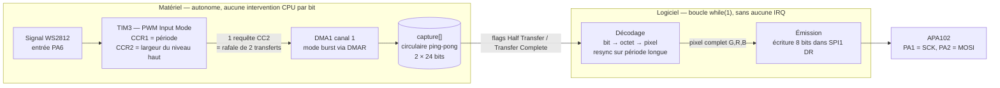

# ws2812-apa102

**Convertisseur de protocole LED : décode un flux WS2812 en entrée et le
retransmet en APA102 — sur un STM32G030F6 (Cortex-M0+, 32 Ko flash, 8 Ko RAM).**

> 🚧 **Projet en cours.** La chaîne de capture est validée sur matériel ; le
> décodage et la sortie APA102 compilent et sont câblés, mais n'ont pas encore
> été confirmés sur banc. Voir [Statut](#statut).

---

## Le problème

Le WS2812 encode chaque bit par la **durée du niveau haut** d'une impulsion :
~0,35 µs pour un `0`, ~0,9 µs pour un `1`, avec une période totale d'environ
1,2 µs. À 800 kbit/s, cela laisse **moins de 80 cycles CPU par bit** sur un
Cortex-M0+ à 64 MHz.

Décoder ce flux *et* générer simultanément une sortie SPI en faisant intervenir
le processeur à chaque bit est structurellement impossible. C'est mesuré, pas
supposé : une première implémentation en *polling* a été chronométrée à
**1,36 µs par bit** pour un budget de 1,17 µs, et perdait des bits par
surcapture du timer.

La solution retenue déplace la contrainte temps réel **entièrement dans le
matériel**. Le CPU ne voit plus jamais un bit isolé.

## Architecture



Trois idées portent l'ensemble.

**1. Le timer mesure seul, et se réarme seul.** TIM3 en *PWM Input Mode* : deux
canaux de capture lisent la **même** broche sur des fronts opposés, et le
compteur est remis à zéro par le matériel à chaque front montant (*slave mode
Reset*). Aucune lecture CPU n'est nécessaire entre deux captures.

**2. Le DMA en mode burst garantit l'appariement.** Une seule requête (front
descendant) déclenche une rafale de deux transferts qui lisent `CCR1` puis
`CCR2` via le registre virtuel `DMAR`. Période et largeur d'un même bit sont
donc **appariées par construction** — avec deux canaux DMA séparés, le décalage
aurait dépendu de l'état du signal au démarrage, sans jamais se rattraper.

**3. La sortie n'a aucune contrainte de temps.** Contrairement au WS2812,
l'APA102 est cadencé par sa propre horloge : rien n'impose de délai entre deux
octets. Chaque pixel part donc **dès qu'il est décodé**, sans buffer de trame et
sans limite sur le nombre de LEDs — qui n'a pas besoin d'être connu à l'avance.

Résultat : le budget passe de ~75 cycles *par bit* à ~1900 cycles *par paquet de
24 bits*, et un seul canal DMA sur les cinq disponibles est consommé.

## Synchronisation des pixels

Le décodeur ne compte pas les bits modulo 24 — une telle approche dérive
silencieusement dès qu'un bit est perdu. Il s'appuie sur la **période** mesurée :
le contrôleur source insère un délai allongé entre pixels, qui s'ajoute à la
période du premier bit du pixel suivant. Toute période hors gabarit haut marque
donc une frontière de pixel, ce qui **resynchronise la trame en continu**.

## Matériel

| Broche | Pin TSSOP20 | Fonction | AF |
|---|---|---|---|
| `PA6` | 13 | Entrée WS2812 | `TIM3_CH1`, AF1 |
| `PA1` | 8 | Horloge APA102 | `SPI1_SCK`, AF0 |
| `PA2` | 9 | Données APA102 | `SPI1_MOSI`, AF0 |
| `PA4` | 11 | LED témoin | GPIO |

Le *PWM Input Mode* n'occupe **qu'une seule broche physique** : le second canal
de capture lit le même signal en interne.

Horloge système : HSI 16 MHz → PLL → **SYSCLK 64 MHz**, AHB et APB sans division.

## Compilation et flash

Dépendances : `arm-none-eabi-gcc`, `make`, le package **STM32CubeG0** (HAL +
CMSIS), et `openocd` pour le flash.

```sh
make                # compile -> build/stm32g030f6.elf | .hex | .bin
make flash          # flashe via OpenOCD (verify + reset)
make clean
```

Le flash utilise une sonde **J-Link** pilotée par OpenOCD. Le dossier contenant
`interface/jlink.cfg` et `target/stm32g0x.cfg` vit hors du dépôt ; son
emplacement se surcharge sans modifier le `Makefile` :

```sh
make flash OPENOCD_SCRIPTS=/chemin/vers/mes/configs
```

Le chemin du SDK se règle via `SDK_SRC` en tête de `Makefile`.

> Les fichiers HAL sont listés **explicitement** dans `HAL_SOURCES` (pas de
> wildcard) : ajouter un périphérique implique d'ajouter son
> `stm32g0xx_hal_xxx.c`.

## Quelques trouvailles au passage

Ce projet a demandé pas mal de lecture de documentation. Les points les moins
évidents sont consignés dans **[STM32G030-reference.md](STM32G030-reference.md)** :

- **Le prefetch flash est désactivé au reset** (`FLASH_ACR.PRFTEN`), et aucune
  fonction HAL ne l'active. À 64 MHz avec 2 wait states, chaque franchissement
  de ligne d'instruction coûtait le prix fort.
- **`-Ofast` dégrade** les performances d'un chemin chaud sur ce cœur : code plus
  volumineux, plus de branchements, donc plus de défauts de cache d'instructions
  — lequel ne fait que 2 lignes de 64 bits.
- **Écrire dans `SPIx_DR` en accès 32 bits émet deux octets** au lieu d'un, via
  le *data packing* automatique du FIFO. Le champ étant déclaré `uint32_t`, le
  cast 8 bits est obligatoire.
- Les timings réels du contrôleur testé **s'écartent nettement du nominal** : bit
  à `1` mesuré à 0,93 µs au lieu de 0,7 µs. Les seuils sont calés sur des
  relevés, pas sur le datasheet.

## Statut

| Étape | État |
|---|---|
| Capture TIM3 + DMA burst | ✅ validée sur matériel (buffer cohérent, pulse stable) |
| Décodage bit → octet → pixel | ⚠️ compile, non confirmé sur banc |
| Sortie APA102 en continu | ⚠️ compile, non confirmée sur banc |
| Ordre des octets APA102 | ❓ à vérifier sur une vraie chaîne de LEDs |

Limite connue : le gap de reset WS2812 doit rester sous ~1,02 ms, sans quoi le
compteur 16 bits sans prédiviseur reboucle.

## Historique

Le projet a d'abord été tenté sur un **ATtiny202**, puis abandonné : trop
contraint en broches et en cycles pour décoder le WS2812 et alimenter une sortie
SPI en parallèle. Quatre architectures y ont été écartées, toutes butant sur la
même cause — un CPU obligé de réagir à chaque bit. Le portage sur STM32G030 a été
choisi précisément pour son DMA configurable et sa marge d'horloge.

## Licence

[MIT](LICENSE)
